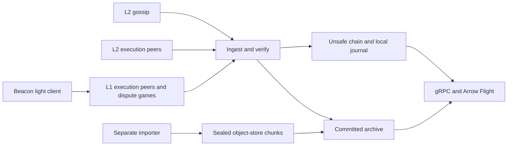

# Current architecture

The platform supplies verified OP Stack chain data without executing transactions or keeping
an EVM state. One node follows one chain: OP Mainnet, Unichain or Base. Consumers use the same
gRPC and Arrow Flight interfaces whether history is local or in object storage.

## Data flow

The archive is either local fjall (`indexer`) or sealed chunks plus a local fjall tail
(`server`). The node verifies gossip signatures, block links and transaction/receipt roots.
Its L1 tracking verifies dispute-game claims against its own blocks. **Safe** means a matching
claim on L1; **finalized** means that claim's L1 block is finalized, not that a dispute game
has resolved or that the node derived and executed the L2 chain. See [the trust contract](l1.md#3-trust).

## Programs

| Program | Responsibility | Persistent state |
|---|---|---|
| `indexer` | Standalone ingestion, peer serving and consumer APIs | Identity, peers, unsafe journal and full local fjall archive |
| `server` | The same node with object-store history; optionally the sole exporter | Identity, peers, unsafe journal and local unsealed tail |
| `import` | Download, fill missing source fields, verify and publish initial history | Resumable import progress and downloaded chunks until uploaded |
| `balancer` | Register servers, schedule Flight ranges and locate subscriptions | In-memory registrations rebuilt after restart; reads the shared manifest |

All fleet servers read the same sealed history. The balancer tracks health, contiguity,
capacity and load, not private chunk ownership. Clients receive server locations and fetch
data directly. Exactly one server exports newly finalized, complete chunks with a write key;
other servers use read-only keys. The importer stays a separate process because its external
archive/RPC sources and bulk processing are bootstrap concerns.

## Boundaries

- `primitives` and `chainspec`: shared domain types and chain values.
- `p2p`, `el`, `l1`: network protocols and verification, independent of storage implementations.
- `storage`: unsafe and archive contracts, local persistence and retry classification.
- `pipeline`: ingestion, receipts, gap fill and promotion into storage.
- `chunks`: immutable chunk format, manifests, hash indexes and object-store access.
- `server`: the archive that combines sealed history with a local tail, and export.
- `stream`: gRPC/Flight implementation and transition from history to live data.
- `node`: component construction, sync coordination and supervised staged shutdown.
- `balancer`: fleet membership and request placement.
- `runtime`: shared environment loading, tracing setup and shutdown signals.
- `api`: authentication and Flight ticket contracts, without storage or node dependencies.

History consumers own a range reader, including its read-ahead and cancellation lifetime.
Readers share the server's memory budget. Point lookups remain separate. Finality, receipt
checks, reorg handling and backpressure remain part of their existing contracts.

## Operating modes

Existing environment-only configurations retain their defaults when no profile is selected.
Opt-in profiles group related capabilities; explicit environment overrides still undergo
validation. See the README and `.env.example` for commands and profile requirements.

Use `import run` for ordinary bootstrapping; `download` and `verify` remain independently
resumable commands for recovery and advanced operation. Import publication waits until the
range matches its anchor; uploading an object alone does not make it visible in the manifest.

## Status and next work

[Roadmap and delivery status](roadmap.md) is the single list of finished implementation,
pending implementation, validation gates and undecided architecture changes. Protocol specs
retain their detailed contracts and dated measurements: [serving](serving.md), [import](import.md),
[execution peers](el.md), [L1](l1.md) and [peer duties](citizenship.md).
