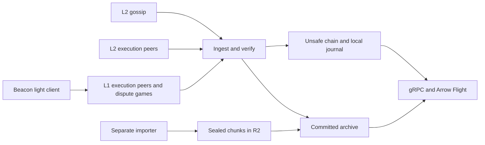

# Architecture

What the system is today: its programs, how data flows through them and why it can be
trusted. Status 2026-10-05: the node, directory and import programs are built and have run live: nodes on OP
Mainnet and Unichain, a Unichain fleet of three servers and a balancer serving from R2, and
Base's import (downloaded, being completed). A native `bench` client measures Flight reads,
including heavy multi-table workloads. What is left is in
[roadmap.md](roadmap.md); how it got here is in [decisions.md](decisions.md).

The platform supplies verified OP Stack chain data without executing transactions or keeping
EVM state. One node follows one chain: OP Mainnet, Unichain or Base. Consumers get history and
the live chain through the same gRPC and Arrow Flight interfaces whether the history is on the
node's disk or in object storage.

## Data flow

- **Live chain**: blocks arrive over gossip, signed by the sequencer; their receipts come from
  L2 execution peers. Both are verified, kept in the unsafe chain in memory (journaled to
  fjall) and streamed at once. Gaps fill by range sync from execution peers.
- **Committed history**: when a dispute game on L1 claims an L2 block the node holds, the
  blocks up to it are promoted into the archive. The archive is a local fjall store
  (`indexer`), or sealed, immutable chunks in Cloudflare R2 read on demand plus a local fjall
  tail of the blocks not sealed yet (`server`). Specs: [storage.md](storage.md),
  [serving.md](serving.md).
- **Bootstrap**: the separate importer downloads a range once from an external archive (Envio
  HyperSync), verifies every block and uploads it as sealed chunks
  ([import.md](import.md)). The running node never calls it or any RPC.

## Trust

- **Unsafe**: a block's header is signed by the chain's sequencer (gossip validation); its
  transactions and receipts are checked against the header's roots.
- **Safe**: a dispute game on L1 claims an output root equal to the node's own block's. L1 is
  read without an RPC: a beacon light client vouches for L1 block hashes, and the games are
  fetched over L1 devp2p and verified against them ([l1.md](l1.md)). **Finalized**: that
  claim's L1 block is finalized. Neither means a game has resolved, or that the node derived or
  executed the chain ([the trust contract](l1.md#3-trust)).
- **Sealed history**: every block of a chunk was verified before it was sealed (header hash,
  parent links, transactions and receipts roots, senders); readers check each segment's
  sha256 against the chunk's index and the index against the hash-chained manifest
  ([serving §1.5](serving.md#15-integrity-how-a-server-checks-a-fetched-chunk)).

## Programs

| Program | Does | Keeps |
|---|---|---|
| `indexer` | The full node for one user: p2p ingestion, L1 tracking, peer serving, gRPC and Flight | Identity, peers, the unsafe chain's journal and the whole history in fjall |
| `server` | The same node with its history in R2; with `--export`, the deployment's one exporter of newly finalized chunks | Identity, peers, the unsafe chain's journal and the fjall tail not sealed yet |
| `balancer` | The fleet's directory: servers register and report load; it splits a Flight range into per-chunk jobs on the least-loaded servers, locates subscriptions, and signs R2 URLs for raw chunk downloads. No block data passes through it | Registrations in memory, rebuilt as servers report |
| `import` | `download` (from HyperSync, each answer checked and asked again when incomplete), `verify` (check, seal, upload, list in the manifest once the range matches its anchor), `run` (both), `fetch` (raw chunks from R2 for a client) | The plan and the downloaded chunks until they are uploaded |
| `bench` | Native Flight consumer: validates plans and streamed block ranges, measures throughput and retries, repeats single-table or heavy four-table workloads ([usage](bench.md)) | Optional JSON reports; decoded batches are discarded |

`indexer`, `server` and `balancer` also take `start`, `stop`, `restart`, `status`, `logs` and
`install-service`, to run in the background; settings come from the chain
`config.toml` ([configuration.md](configuration.md)). All fleet servers read the same sealed history;
exactly one exports, with a write key, and the rest read only.

## Crates

- `primitives`, `chainspec`: shared types and every per-chain value.
- `p2p`, `el`, `l1`: the consensus gossip, execution and L1 networks and their verification;
  none depends on storage.
- `storage`: the unsafe chain and the fjall archive, their traits, the retry policy.
- `pipeline`: ingestion, receipts, gap fill, promotion into the archive.
- `chunks`: the chunk format, the manifest, the hash index and the R2 client.
- `server`: the archive over sealed chunks plus the local tail, and the exporter.
- `stream`: gRPC and Flight, history then live.
- `node`: wiring, machine sizing, sync coordination, staged shutdown.
- `balancer`, `api`, `runtime`: fleet directory; shared keys, tickets and schemas; TOML configuration,
  tracing, signals and service commands.

The dependency rules between them are in the repository's `CLAUDE.md`.

## Operating modes

With no profile, the settings in TOML decide what runs. The `live`, `archive` and `fleet`
profiles (`<role>.profile`) group the usual combinations and are checked at startup. The
tuning limits are sized from the machine's cores and memory and logged at startup. See the
README and `config.toml.example` for commands and profile requirements, and
[configuration.md](configuration.md) for the schema, machine-sized defaults and explicit legacy migration.
